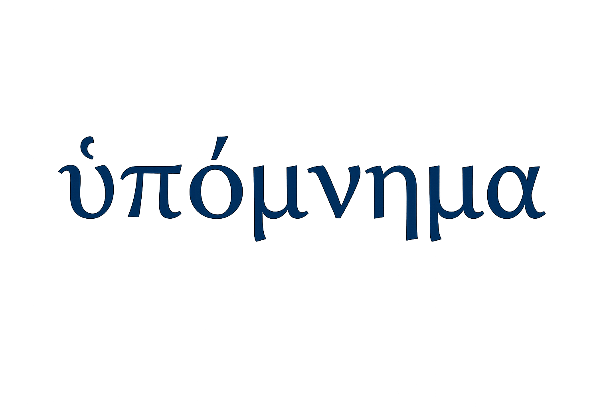

<p align="center">
  
</p>

<p align="center">
  <strong>An automated ontological synthesizer.</strong><br>
  Drop in notes, PDFs, and URLs. Get back a living knowledge network.
</p>

<p align="center">
  <a href="https://github.com/junhewk/hypomnema/actions/workflows/ci.yml"></a>
  <a href="https://github.com/junhewk/hypomnema/releases"></a>
  <a href="./LICENSE"></a>
  <a href="https://www.python.org/"></a>
  <a href="https://go.dev/"></a>
</p>

<p align="center">
  <a href="./LICENSE">AGPL-3.0</a> &middot;
  <a href="./CHANGELOG.md">Changelog</a> &middot;
  <a href="./DEVELOPMENT.md">Development</a>
</p>

---

Hypomnema extracts concepts from your research material, deduplicates them, links them with typed relationships, and renders the result as an explorable 3D network. No folders, no tags, no manual organization.

## Features

- **Zero-friction input** — scribbles, PDF/DOCX/Markdown upload, URL scraping with main-content extraction (`go-trafilatura` on the Go stack, Jina Reader fallback for JS-rendered/paywalled pages), RSS/YouTube feeds
- **Smart PDF extraction** — layout-aware parsing via [opendataloader-pdf](https://github.com/opendataloader-project/opendataloader-pdf) with column detection and structure preservation; pypdf fallback
- **Automatic ontology** — LLM-powered entity extraction, multi-stage deduplication (exact match, alias index, KNN, vector similarity, concept hash), typed edge generation (supports, contradicts, critiques, extends, ...)
- **Engram articles** — LLM-synthesized wiki articles for each concept, compiled from all linked documents (inspired by [Karpathy's LLM Knowledge Base](https://x.com/karpathy/status/2039805659525644595))
- **Knowledge linting** — automated quality checks: orphan detection, contradiction finding, missing link suggestions
- **Query synthesis** — search results can be synthesized into new documents that feed back into the knowledge graph
- **Cluster overviews** — auto-generated labels and summaries for each thematic cluster in the visualization
- **Title + TL;DR** — files and URL fetches get an LLM-generated title revision and concise summary; scribbles get full tidy rewriting
- **3D visualization** — constellation-mode point cloud with PageRank node sizing, cluster color reveal, clusters legend panel, per-cluster spread control, node drag, hover labels (via Three.js + three-forcegraph)
- **Document revision** — scribbles are editable in-place; URLs/files/feeds get a user annotation layer. Every edit is revision-logged and re-processed incrementally (engram diff with 50% churn fallback to full rebuild). Feeds into heat scoring.
- **Document heat scoring** — graph-derived actionability signal classifies documents as active, reference, or dormant based on temporal recency, concept co-activity, revision count, and graph centrality. No manual filing — organization emerges from the knowledge graph.
- **Full-text + semantic search** — FTS5 for keyword search (including annotations), sqlite-vec for vector similarity, reciprocal rank fusion
- **Multi-provider** — Claude, Gemini, OpenAI, Ollama for LLM; OpenAI or Google for embeddings. Hot-swappable at runtime.
- **Single-file database** — everything in one portable SQLite file. No Postgres, no external services.
- **Knowledge companion** — baby dinosaur mascot in the sidebar that grows through 5 stages with your engram count; mood reflects lint health (happy/concerned/distressed); idle animations (hop, spin, roar, etc.)
- **Themeable UI** — switchable colour themes (Midnight, Graphite, Phantom), adjustable font size (90%-120%), serif/sans typography via Cormorant Garamond + DM Sans
- **Encrypted at rest** — API keys stored with Fernet encryption
- **Desktop app** — native window via pywebview, built with PyInstaller for macOS/Windows/Linux

## Two Deployment Stacks

Hypomnema ships as both a **Python application** (full-featured, for desktop/server) and a **Go server** (lightweight, for resource-constrained devices like Raspberry Pi 3).

Both stacks share the same SQLite database schema, API contract, and feature set.

| Stack | Binary size | RAM usage | Use case |
|-------|------------|-----------|----------|
| **Python** (NiceGUI) | ~400 MB (with deps) | ~200 MB | Desktop, full server, development |
| **Go** (static SPA) | ~20 MB | ~30 MB | Raspberry Pi, ARM, headless server |

## Quick Start

### Python (full-featured)

```bash
uv sync
uv run hypomnema dev
```

Opens `http://localhost:8073`. On first run, a setup wizard guides you through embedding and LLM provider configuration.

### Go server (lightweight)

```bash
cd server
CGO_ENABLED=1 go build -tags sqlite_fts5 -o hypomnema ./cmd/hypomnema
./hypomnema                                           # local mode
HYPOMNEMA_MODE=server HYPOMNEMA_HOST=<ip> ./hypomnema # server mode
```

> **Note:** The `-tags sqlite_fts5` build tag is required — it enables SQLite full-text search. Omitting it will cause FTS queries to fail at runtime. `CGO_ENABLED=1` is also mandatory since the SQLite driver uses cgo.

Pre-built binaries for Linux (amd64, arm64, armv7) and macOS (arm64, amd64) are available on the [Releases](https://github.com/junhewk/hypomnema/releases) page.

### Docker

```bash
docker compose up --build
```

Runs at `http://localhost:8073`. Data persists in `./data/`.

### Desktop app

Download the latest `.app` (macOS) or `.exe` (Windows) from [Releases](https://github.com/junhewk/hypomnema/releases). No Python or dependencies required.

## Configuration

All settings use the `HYPOMNEMA_` prefix. Copy [`.env.example`](./.env.example) for a full reference.

| Variable | Default | Description |
|----------|---------|-------------|
| `HYPOMNEMA_LLM_PROVIDER` | `google` | `claude`, `google`, `openai`, or `ollama` |
| `HYPOMNEMA_EMBEDDING_PROVIDER` | `google` | `openai` or `google` |
| `HYPOMNEMA_ANTHROPIC_API_KEY` | | Required if using Claude |
| `HYPOMNEMA_GOOGLE_API_KEY` | | Required if using Gemini |
| `HYPOMNEMA_OPENAI_API_KEY` | | Required if using OpenAI |
| `HYPOMNEMA_PASSPHRASE` | | Pre-set auth passphrase (server/Docker mode) |
| `HYPOMNEMA_DB_PATH` | `data/hypomnema.db` | SQLite database location |

LLM provider and API keys can also be configured at runtime via the Settings UI. Embedding provider is chosen at first-run setup — changing it later triggers a full knowledge graph rebuild.

## Architecture

### Python stack

- **App** — [NiceGUI](https://nicegui.io/) serves both the UI and the FastAPI API. No separate frontend build step, no Node.js.
- **Database** — SQLite + WAL mode + [sqlite-vec](https://github.com/asg017/sqlite-vec): single portable file for all data and vector search
- **Backend** — Python / FastAPI routers: orchestrate LLM calls, document parsing, embedding, feed scheduling

### Go stack

- **Server** — [chi](https://github.com/go-chi/chi) HTTP router with embedded static SPA frontend and `go-trafilatura` for article-body extraction from fetched web pages
- **Database** — Same SQLite schema via [go-sqlite3](https://github.com/mattn/go-sqlite3) + [sqlite-vec](https://github.com/asg017/sqlite-vec-go-bindings)
- **Projection** — Pure-Go UMAP ([umap-go](https://github.com/nozzle/umap-go)) + HDBSCAN clustering
- **LLM/Embeddings** — Raw HTTP clients for Claude, Gemini, OpenAI, Ollama (no SDKs)

### Deployment modes

| Mode | Python | Go | Use case |
|------|--------|-----|----------|
| Local | `uv run hypomnema dev` | `./hypomnema` | Development, personal use |
| Server | `uv run hypomnema serve` | `HYPOMNEMA_MODE=server ./hypomnema` | Always-on, remote access via Tailscale/LAN |
| Docker | `docker compose up` | — | Self-hosted server, single container |
| Desktop | `uv run hypomnema desktop` | — | Native window via pywebview |

### Ontology pipeline

```
Document → Extract entities (LLM) → Normalize & dedup → Embed → Link edges (LLM)
  → Heat score → UMAP projection → Cluster synthesis → Article synthesis → Lint
```

### SQLite service model

Hypomnema is designed around SQLite as the primary persistence layer, not as a temporary stand-in for Postgres.

- **Intended scope** — single user, including inter-device access over LAN/Tailscale
- **Write model** — WAL mode, `BEGIN IMMEDIATE`, and an app-level per-database write gate serialize mutating transactions
- **Operational rule** — keep writes short and let the ontology queue handle long-running extraction/linking work outside the transaction itself
- **What to avoid** — editing the live database from external tools while the app is running; use backups or copied `.db` files for inspection and maintenance

This means "server" mode is for reaching your own data from multiple devices, not for multi-member concurrent use.

## Contributing

```bash
# Python
uv sync
uv run ruff check .
uv run mypy .
uv run pytest

# Go
cd server
go vet ./...
CGO_ENABLED=1 go build -tags sqlite_fts5 ./cmd/hypomnema
```

See [DEVELOPMENT.md](./DEVELOPMENT.md) for architecture details and implementation notes.

## License

[AGPL-3.0](./LICENSE)
